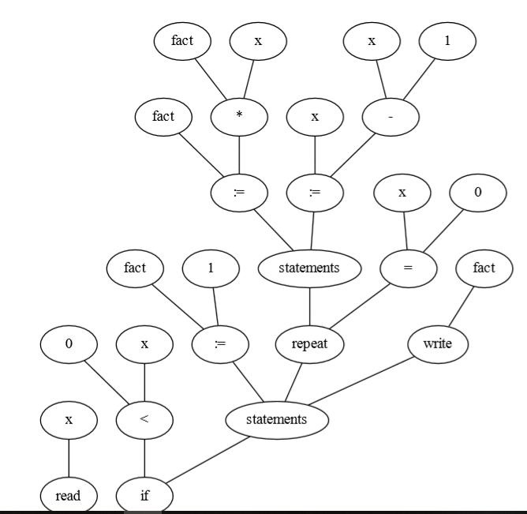

# Tiny-parser

The tiny language is basic programming syntax that is used in many programming languges [learn more](http://jlu.myweb.cs.uwindsor.ca/214/language.htm) 

# Sample IO

Input : [input.txt](./input.txt)

Scanner output : [output.txt](./output.txt)

Pareser output :

